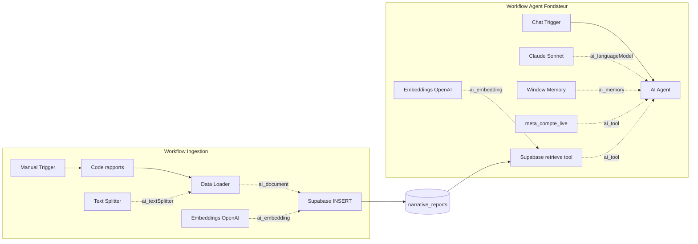

# SEA Copilot — Package n8n (v1)

Copilote conversationnel pour **fondateur d'agence SEA** : analyse comptes Meta Ads, priorisation rétention client, accès données live (démo) et historique narratif (RAG Supabase).

## Vue d'ensemble produit

| Élément | Description |
|---------|-------------|
| **Cible** | Fondateur / directeur d'agence qui gère plusieurs comptes Meta |
| **Workflow chat** | `sea-copilot-chat-v1.json` — Agent LangChain + outils |
| **Workflow ingest** | `sea-copilot-ingest-v1.json` — Charge les rapports dans Supabase |
| **Données démo** | Compte **Lumière Paris**, campagne **Panier Abandon DÉCROCHE**, ROAS **3,42** (Mai 2026) |
| **Génération** | `python3 build_sea_copilot_v1.py` régénère les JSON |

Le fondateur pose des questions en langage naturel ; l'agent structure les réponses en 4 blocs (va bien / décroche / 48 h / message client) et appelle les outils quand nécessaire.

---

## Agent vs Chain vs LangGraph — quand utiliser quoi ?

| Approche | Quand l'utiliser | Ce package |
|----------|------------------|------------|
| **Basic LLM Chain** | Prompt fixe, une passe, sortie structurée (JSON parser) | Non — trop rigide pour le chat fondateur |
| **AI Agent** | Conversation, choix d'outils, plusieurs étapes de raisonnement | **Oui** — workflow chat |
| **LangGraph / workflows custom** | Processus métier très contrôlé, branches complexes, audit strict | Phase 2+ si vous codifiez un graphe métier |

**Règle pratique :** dès que le fondateur doit *poser des questions de suivi* et *décider quel outil appeler* (live vs archives), prenez un **Agent**.

---

## Architecture

---

## Mémoire session vs Vector Supabase

| | **Window Buffer Memory** | **Supabase Vector (`search_rapports_meta`)** |
|--|--------------------------|-----------------------------------------------|
| **Contenu** | Derniers messages du chat (12 tours) | Rapports markdown archivés, chunkés |
| **Durée** | Session (`sessionId`) | Permanent (jusqu'à purge table) |
| **Usage** | Fil de conversation « aujourd'hui » | « Qu'avions-nous dit en avril sur Panier Abandon ? » |
| **Sans config** | Fonctionne dès Anthropic OK | Nécessite SQL + ingest + credentials |

---

## CLIENT vs ce workflow

| Besoin CLIENT (livraison agence) | Ce workflow (interne fondateur) |
|----------------------------------|----------------------------------|
| Rapport PDF / Notion brandé | Chat n8n + prompts agence |
| Données 100 % API Meta | Outil Code démo → HTTP Meta en prod |
| Accès client final | Réservé fondateur / stratégie |
| SLA et historique legal | RAG Supabase + playbooks internes |

---

## Import pas à pas

1. **Supabase** : exécuter `supabase-setup.sql` (SQL Editor).
2. **n8n** : *Workflows → Import from File* → `sea-copilot-ingest-v1.json`.
3. Credentials **OpenAI** (embeddings) + **Supabase** sur les nœuds concernés.
4. Exécuter **une fois** le workflow ingestion (Manual Trigger).
5. Importer `sea-copilot-chat-v1.json`.
6. Credential **Anthropic** + re-vérifier OpenAI/Supabase sur le workflow chat.
7. Ouvrir l'UI Chat du workflow agent → tester : *« Où en est Lumière Paris sur Panier Abandon ? »*

Régénération des exports : `python3 build_sea_copilot_v1.py`.

---

## Credentials

| Credential | Nœuds | Obligatoire |
|------------|-------|-------------|
| **Anthropic account** | Claude Sonnet (chat) | Oui (chat) |
| **OpenAI account** | Embeddings `text-embedding-3-small` | Oui (ingest + RAG chat) |
| **Supabase account** | Vector store INSERT + retrieve tool | Optionnel phase 1 ; requis pour RAG |

Placeholder names dans le JSON : `Anthropic account`, `OpenAI account`, `Supabase account`.

---

## supabase-setup.sql

1. Projet Supabase → **SQL Editor** → coller le fichier → Run.
2. Vérifier : `select count(*) from narrative_reports;` (0 au départ).
3. Dans n8n ingest, le nœud INSERT utilise la table `narrative_reports` et la fonction `match_narrative_reports`.

Extension **vector**, dimension **1536** (OpenAI `text-embedding-3-small`).

---

## Documentation nœud par nœud — Agent Fondateur (`sea-copilot-chat-v1.json`)

| Nœud | TYPE | RÔLE | INPUT | OUTPUT | POURQUOI | Alternatives rejetées |
|------|------|------|-------|--------|----------|---------------------|
| 📋 Guide | stickyNote | Doc in-canvas | — | — | Onboarding import | PDF externe (moins visible) |
| Quand un message chat arrive | `@n8n/n8n-nodes-langchain.chatTrigger` v1.4 | Entrée chat n8n | Message utilisateur | `chatInput`, `sessionId` | Natif n8n 2026 | Webhook custom (plus de config) |
| AI Agent — Copilote SEA | `agent` v1.7 | Orchestration LLM + tools | chatInput | Réponse agent | Raisonnement multi-outils | Chain LLM (pas de tools dynamiques) |
| Claude Sonnet | `lmChatAnthropic` v1.3 | Modèle | — | LLM branch | Qualité rédaction FR | GPT (OK mais spec Anthropic) |
| Mémoire session | `memoryBufferWindow` v1.3 | Contexte 12 tours | sessionId | memory | Suivi conversation | Postgres memory (phase 2) |
| meta_compte_live | `toolCode` v1.1 | Métriques live démo | Requête agent | JSON string | Données sans API | HTTP Meta direct (prod) |
| Supabase search_rapports_meta | `vectorStoreSupabase` retrieveAsTool | RAG rapports | Query embed | Passages | Historique narratif | Google Drive search (hors stack) |
| Embeddings OpenAI | `embeddingsOpenAi` v1.2 | Vecteurs query | texte | embedding | Requis par vector store | Modèles locaux (ops lourdes) |
| Phase 2 Supabase | stickyNote | Rappel config | — | — | Réduit erreurs setup | — |

**Connexions LangChain critiques :** trigger → agent (main) ; Claude → agent (ai_languageModel) ; memory → agent (ai_memory) ; tools → agent (ai_tool) ; embeddings → vector (ai_embedding).

---

## Documentation nœud par nœud — Ingestion (`sea-copilot-ingest-v1.json`)

| Nœud | TYPE | RÔLE | INPUT | OUTPUT | POURQUOI | Alternatives rejetées |
|------|------|------|-------|--------|----------|---------------------|
| 📋 Guide | stickyNote | Procédure ingest | — | — | Run once | — |
| Lancer ingestion manuelle | `manualTrigger` | Déclenchement | Clic | 1 item | Test / batch ponctuel | Schedule (rapports pas toujours cadencés) |
| Préparer rapports démo | `code` v2 | 4 docs markdown + metadata | — | items `text`, `metadata` | Reproductible sans fichiers | Read Binary File (paths serveur) |
| Default Data Loader | `documentDefaultDataLoader` | Documents LangChain | text | documents | Pipeline RAG standard | Passage texte brut sans loader |
| Recursive Text Splitter | `textSplitterRecursiveCharacterTextSplitter` | Chunks 800/100 | — | splitter | Limite taille embedding | Fixed size sans overlap |
| Embeddings OpenAI | `embeddingsOpenAi` | Vecteurs chunks | chunks | vectors | 1536 dims | Autre dimension (casser SQL) |
| Supabase INSERT | `vectorStoreSupabase` insert | Persist RAG | docs+vectors | rows | Table partagée avec chat | Pinecone (coût/complexité) |

---

## Mode démo vs production

| Composant | Démo (v1) | Production |
|-----------|-----------|------------|
| Métriques Meta | `toolCode` JSON statique Lumière Paris | `toolHttpRequest` ou sous-workflow Meta Marketing API |
| Rapports | Code node + `knowledge/rapports-demo.md` | Notion/Google Drive → ingest automatisé |
| Mémoire | Window buffer | + Postgres Chat Memory multi-utilisateur |
| Supabase | Optionnel | Obligatoire pour historique multi-clients |

---

## Dépannage

| Symptôme | Cause probable | Action |
|----------|----------------|--------|
| Agent répond sans chiffres | Tool non appelé | Reformuler « utilise meta_compte_live » ; vérifier lien ai_tool |
| Erreur embedding | Clé OpenAI / quota | Tester credential sur nœud Embeddings |
| Vector vide | Ingest non exécuté | Run workflow ingest ; `select count(*) from narrative_reports` |
| Dimension vector | Mauvais modèle embedding | Garder `text-embedding-3-small` (1536) |
| Chat sans session | sessionId manquant | Utiliser UI Chat n8n (fournit sessionId) |
| Supabase match fail | Fonction SQL absente | Re-run `supabase-setup.sql` |

---

## Roadmap phase 2

- **Postgres Chat Memory** : sessions persistées par fondateur / client.
- **Meta Marketing API** : remplacer `meta_compte_live` par HTTP OAuth + insights réels.
- **Ingest automatique** : webhook Notion → ingest on publish.
- **LangGraph** (optionnel) : validation humaine avant « message client ».

---

## Fichiers du package

| Fichier | Rôle |
|---------|------|
| `build_sea_copilot_v1.py` | Génère les deux JSON |
| `sea-copilot-chat-v1.json` | Agent fondateur |
| `sea-copilot-ingest-v1.json` | Ingestion RAG |
| `supabase-setup.sql` | Schema pgvector |
| `knowledge/rapports-demo.md` | Sources markdown test |
| `README.md` | Ce document |
